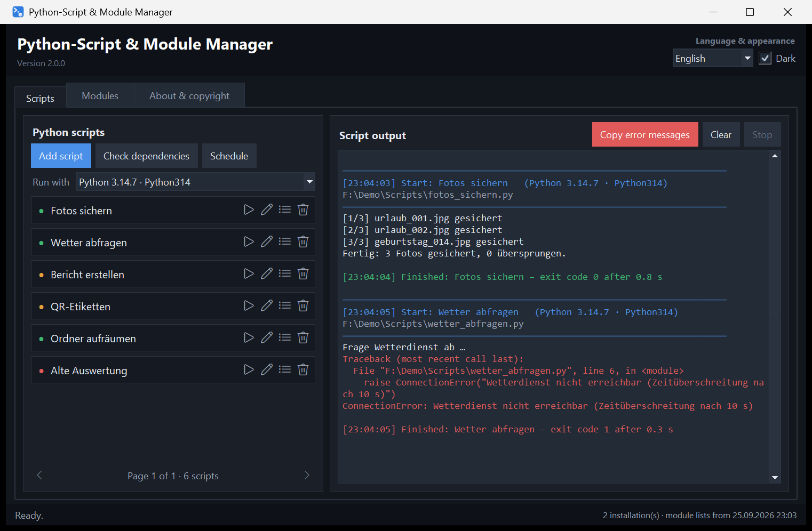
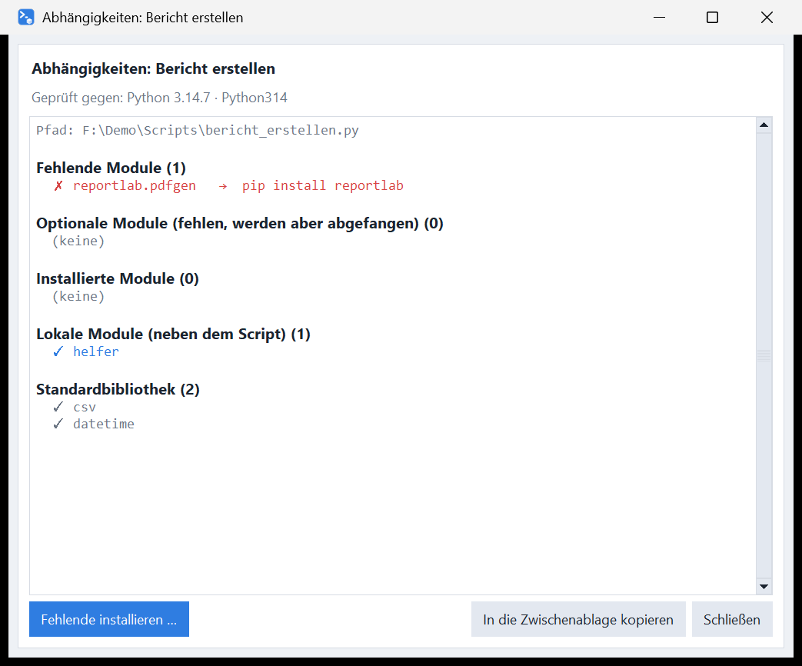
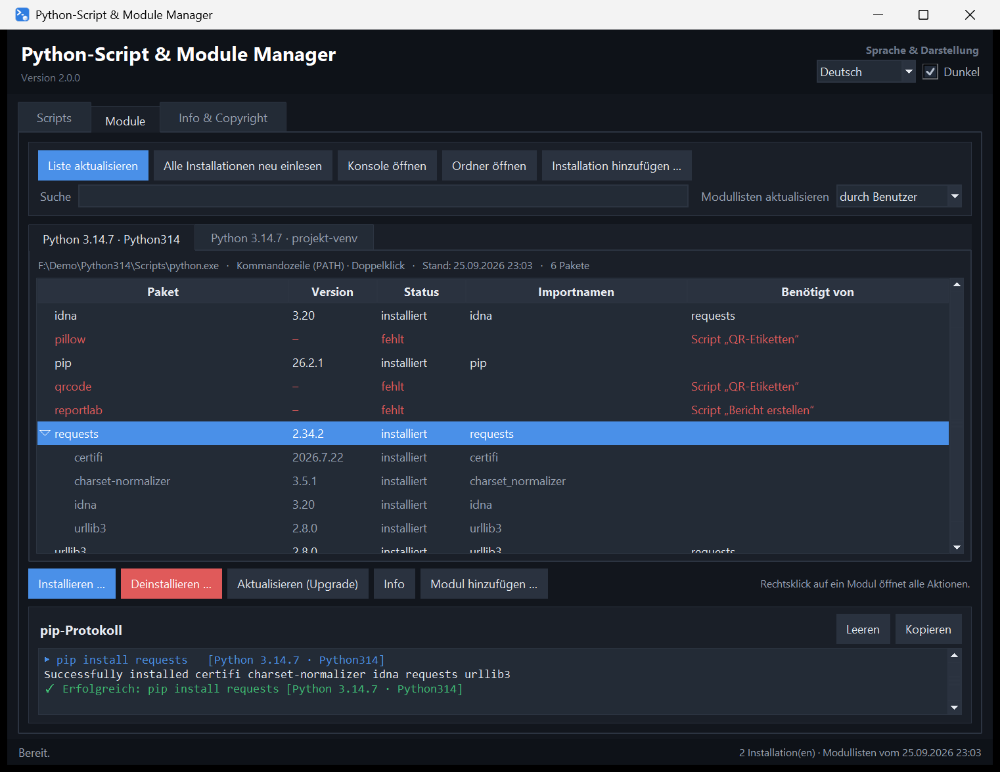

# Python-Script & Module Manager

[](https://github.com/DerAlexmann/python-script-module-manager/actions/workflows/ci.yml)

Runs your Python scripts with one click and shows their output. Before a
script runs, it checks that all required modules are present. It manages the
modules of every Python installation on the computer: view, install,
uninstall, upgrade. The interface comes in German and English, light and
dark.

*[Deutsche Fassung: README.md](README.md)*



## What it does

### Scripts

- **Script list** with a status dot: green means every module is present;
  orange means a module is missing or the script has a syntax error; red
  means the file has disappeared. The tooltip over the name gives the
  details.
- **Icon buttons** on every row: run, rename, show dependencies, remove from
  the list. Double-clicking the name runs the script as well.
- **Pages instead of a scroll bar:** a page holds as many scripts as the
  window height allows. Turn pages with ◀/▶ or with the mouse wheel.
- **Script output** live, error output in red. Several scripts may run at the
  same time. Each script runs in its own folder, so relative paths work.
- **Copy error messages:** as soon as a script writes to the error output or
  ends with an error code, the button turns red. It puts script, path, Python
  version, traceback and exit code on the clipboard.
- **Run with** any Python installation you choose.
- **Schedule:** run a script every n seconds while the program is open.

### Dependencies



The imports of a script are read from its source code, without running the
script. The rules:

- **Modules next to the script**, **relative imports** and the **standard
  library** do not count as missing.
- **Import name and package name** are told apart: `PIL` belongs to `pillow`,
  `win32api` to `pywin32`, `yaml` to `PyYAML`.
- **Nested modules** are matched to the right package: with
  `from google.cloud import storage`, `google-cloud-storage` is missing even if
  `protobuf` also lives under `google`.
- **Guarded imports** (`try: … except ImportError:`) count as optional. If
  the `except` branch ends the script, the module stays required.
- Whatever appears only under `if TYPE_CHECKING:` does not count.
- Missing modules come with the matching `pip install` command and a button
  that installs them right away.

### Modules



- **One tab per Python installation.** They are found through the registry,
  the `py` launcher, the usual install folders and the `PATH`. The tab shows
  which installation is `python` on the command line and which one a
  double-click on a `.py`/`.pyw` starts. Virtual environments can be added by
  hand.
- **Package list** with version, import names and "Required by". A package's
  dependencies unfold as a tree.
- **Install, uninstall, upgrade** with the buttons or by right-click, either
  in the selected installation only or in all suitable ones. **Every**
  uninstall asks first. The question warns you if other packages or your own
  scripts still need the module.
- **Uninstalled modules stay in the list**, marked red as "missing", and can
  be installed again from there. Modules that a script needs appear as
  "missing" too, on the tab of the installation that runs the scripts.
- **Refresh list** picks up newly installed modules and marks removed ones.
  When this happens is up to you: *automatically* (at every start and after
  the console is closed) or *by the user* (only at the first start and at the
  push of a button).
- **Open console:** a command prompt in which `python` and `pip` belong to
  the selected installation.
- **Open folder:** the installation's folder in Explorer, with `python.exe`
  selected.
- **pip log** with everything pip prints, ready to copy.

### General

- **German and English**, light and dark scheme, both switchable without a
  restart.
- **The window** opens in the centre of the screen the first time and
  remembers its position and size after that.
- **Status bar:** feedback appears as "Last action (time): …" and fades
  after a few seconds. Operations in progress stay visible until they are
  done.

## Running it

**As a program:** download `Python-Script-Module-Manager.exe` from the
[releases](../../releases) and start it. Nothing is installed; the settings
file appears next to it. Scripts and pip run through the Python installations
the program finds, so at least one has to be on the computer.

> **On first start**: the executable is not signed, so Windows SmartScreen
> asks once – "More info" → "Run anyway". Antivirus software also tends to
> hold on to a freshly downloaded, unknown file for a few seconds while it
> scans it; starting the program during that time may fail with "Access
> denied". Wait a moment and start it again. Because the program calls
> `python.exe` several times on first start to find the installations, that
> search may also take noticeably longer than later on. To be on the safe side, compare
> the SHA-256 checksum from the release notes first.

**As a script:** double-click `Python-Script & Module Manager.pyw`. All it
needs is Python 3.10 or newer with Tkinter, which ships with the Windows
installer. No further packages are required.

```bash
python "Python-Script & Module Manager.pyw"
```

## What is stored

Everything lives in `python-script-module-manager.json` next to the program;
the exact path is shown on the "About & copyright" tab. It holds the script
list, the installations found with their module lists, the list of modules
seen before, language, scheme and the window position. If you move the
program to another folder, take the file with you.

## Adding a language

German is the source language: the German text in the code is also the key.
`LANGUAGE_NAMES` and `TRANSLATIONS` sit at the end of
`Python-Script & Module Manager.pyw`. Add a code to `LANGUAGE_NAMES`, add a
section to `TRANSLATIONS`, and the selector in the top right offers the
language right away. Untranslated lines fall back to German automatically.

## Building it yourself

```bash
pip install pyinstaller
build.cmd
```

The result lands in the `dist` folder. The program icon can be recreated with
`python icon_erzeugen.py`, which needs Pillow.

## Contributing

Bug reports, suggestions and translations are welcome –
[CONTRIBUTING.md](CONTRIBUTING.md) covers the layout, the style and the tests
(it is written in German, but issues and pull requests in English are just as
welcome). Please report security issues through the route described in
[SECURITY.md](SECURITY.md) rather than as an issue.

## Licence

[MIT](LICENSE) – Copyright 2026 Alexander Unverhau.
Created with assistance of Claude AI.
