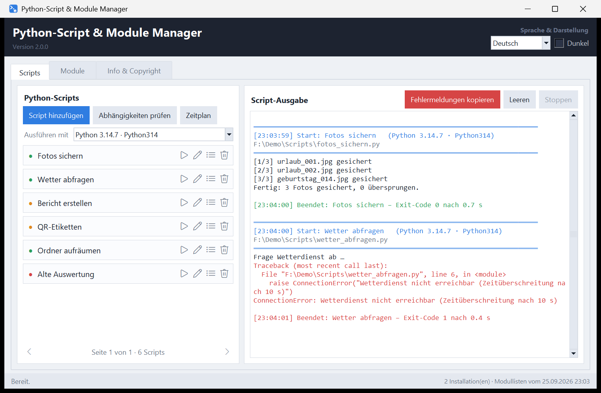

# Python-Script & Module Manager

[](https://github.com/DerAlexmann/python-script-module-manager/actions/workflows/ci.yml)

Startet deine Python-Scripts mit einem Klick und zeigt ihre Ausgabe an. Vor
dem Start prüft er, ob alle benötigten Module da sind. Die Module verwaltet er
für jede Python-Installation auf dem Rechner: einsehen, installieren,
deinstallieren, aktualisieren. Die Oberfläche gibt es auf Deutsch und
Englisch, hell und dunkel.

*[English version: README.en.md](README.en.md)*



## Was er kann

### Scripts

- **Script-Liste** mit Statuspunkt: grün heißt, alle Module sind da; orange
  heißt, es fehlt ein Modul oder das Script hat einen Syntaxfehler; rot heißt,
  die Datei ist verschwunden. Der Tooltip über dem Namen nennt die Einzelheiten.
- **Symbol-Schalter** je Zeile: starten, umbenennen, Abhängigkeiten anzeigen,
  aus der Liste entfernen. Ein Doppelklick auf den Namen startet das Script
  ebenfalls.
- **Seiten statt Rollbalken:** Eine Seite fasst so viele Scripts, wie die
  Fensterhöhe hergibt. Geblättert wird mit ◀/▶ oder mit dem Mausrad.
- **Script-Ausgabe** live, Fehlerausgabe in Rot. Mehrere Scripts dürfen
  gleichzeitig laufen. Jedes Script läuft in seinem eigenen Ordner, so dass
  relative Pfade stimmen.
- **Fehlermeldungen kopieren:** Sobald ein Script etwas auf die Fehlerausgabe
  schreibt oder mit einem Fehlercode endet, wird der Schalter rot. Er legt
  Script, Pfad, Python-Fassung, Traceback und Exit-Code in die Zwischenablage.
- **Ausführen mit** einer frei wählbaren Python-Installation.
- **Zeitplan:** ein Script alle n Sekunden starten, solange das Programm
  läuft.

### Abhängigkeiten


Die Importe eines Scripts werden aus dem Quelltext gelesen, ohne das Script
auszuführen. Dabei gilt:

- **Module neben dem Script**, **relative Importe** und
  **Standardbibliothek** gelten nicht als fehlend.
- **Importname und Paketname** werden auseinandergehalten: `PIL` gehört zu
  `pillow`, `win32api` zu `pywin32`, `yaml` zu `PyYAML`.
- **Verschachtelte Module** werden dem richtigen Paket zugeordnet: Bei
  `from google.cloud import storage` fehlt `google-cloud-storage`, auch wenn
  `protobuf` ebenfalls unter `google` liegt.
- **Abgefangene Importe** (`try: … except ImportError:`) gelten als optional.
  Beendet der `except`-Zweig das Script, bleibt das Modul Pflicht.
- Was nur unter `if TYPE_CHECKING:` steht, zählt nicht.
- Für fehlende Module gibt es den passenden `pip install`-Befehl und einen
  Schalter, der sie gleich installiert.

### Module


- **Ein Reiter je Python-Installation.** Gefunden werden sie über die
  Registry, den Python-Launcher `py`, die üblichen Installationsordner und den
  `PATH`. Der Reiter zeigt, welche Installation `python` auf der Kommandozeile
  ist und welche ein Doppelklick auf eine `.py`/`.pyw` startet. Virtuelle
  Umgebungen lassen sich von Hand hinzufügen.
- **Paketliste** mit Version, Importnamen und „Benötigt von". Die
  Abhängigkeiten eines Pakets klappen als Baum auf.
- **Installieren, deinstallieren, aktualisieren** über Schalter oder per
  Rechtsklick, wahlweise nur in der gewählten oder in allen passenden
  Installationen. Vor **jeder** Deinstallation kommt eine Rückfrage. Sie warnt,
  wenn andere Pakete oder eigene Scripts das Modul noch brauchen.
- **Deinstallierte Module bleiben in der Liste**, rot als „fehlt" markiert,
  und lassen sich von dort wieder installieren. Module, die ein Script
  braucht, stehen im Reiter der ausführenden Installation ebenfalls als
  „fehlt" darin.
- **Liste aktualisieren** nimmt neu installierte Module auf und markiert
  entfernte. Wann das geschieht, ist einstellbar: *automatisch* (bei jedem
  Start und nach dem Schließen der Konsole) oder *durch Benutzer* (nur beim
  ersten Start und auf Knopfdruck).
- **Konsole öffnen:** eine Eingabeaufforderung, in der `python` und `pip` zur
  gewählten Installation gehören.
- **Ordner öffnen:** der Ordner der Installation im Explorer, `python.exe`
  ist dort markiert.
- **pip-Protokoll** mit allem, was pip ausgibt, zum Kopieren.

### Allgemein

- **Deutsch und Englisch**, helles und dunkles Schema, beides ohne Neustart
  umschaltbar.
- **Das Fenster** startet beim ersten Mal in der Bildschirmmitte und merkt
  sich danach Lage und Größe.
- **Statusleiste:** Rückmeldungen erscheinen als „Letzte Aktion (Uhrzeit): …"
  und blenden sich nach einigen Sekunden aus. Laufende Vorgänge bleiben
  stehen, bis sie fertig sind.

## Starten

**Als Programm:** `Python-Script-Module-Manager.exe` aus den
[Releases](../../releases) herunterladen und starten. Es wird nichts
installiert; die Einstellungsdatei entsteht daneben. Die Scripts und pip
laufen über die Python-Installationen, die das Programm findet. Mindestens
eine muss also auf dem Rechner sein.

> **Beim ersten Start**: Die EXE ist nicht signiert. Windows SmartScreen
> fragt deshalb einmalig nach – „Weitere Informationen" → „Trotzdem
> ausführen". Auch ein Virenschutz hält eine frisch heruntergeladene,
> unbekannte Datei gern für ein paar Sekunden fest, während er sie prüft; ein
> Startversuch in dieser Zeit kann mit „Zugriff verweigert" abbrechen.
> Einfach kurz warten und erneut starten. Weil das Programm beim ersten Start
> mehrfach `python.exe` aufruft, um die Installationen zu finden, kann die
> Suche dabei auch deutlich länger dauern als später. Wer sichergehen will, vergleicht
> vorher die SHA-256-Prüfsumme aus den Release-Notizen.

**Als Skript:** `Python-Script & Module Manager.pyw` doppelklicken. Nötig ist
nur Python 3.10 oder neuer mit Tkinter, das bei der Windows-Installation dabei
ist. Weitere Pakete braucht das Programm nicht.

```bash
python "Python-Script & Module Manager.pyw"
```

## Was gespeichert wird

Alles steht in `python-script-module-manager.json` neben dem Programm, der
genaue Pfad auf dem Reiter „Info & Copyright": die Script-Liste, die gefundenen
Installationen samt eingelesener Modullisten, die Liste der schon einmal
gesehenen Module, Sprache, Schema und die Fensterlage. Wer das Programm in
einen anderen Ordner verschiebt, nimmt die Datei mit.

## Eine Sprache ergänzen

Deutsch ist die Quellsprache: Der deutsche Text im Code ist zugleich der
Schlüssel. Am Ende von `Python-Script & Module Manager.pyw` stehen
`LANGUAGE_NAMES` und `TRANSLATIONS`. Ein Kürzel in `LANGUAGE_NAMES`, ein
Abschnitt in `TRANSLATIONS`, und die Auswahl oben rechts bietet die Sprache
sofort an. Nicht übersetzte Zeilen erscheinen automatisch auf Deutsch.

## Selbst bauen

```bash
pip install pyinstaller
build.cmd
```

Das Ergebnis liegt anschließend im Ordner `dist`. Das Programmsymbol lässt
sich mit `python icon_erzeugen.py` neu erzeugen; dafür wird Pillow gebraucht.

## Mitmachen

Fehlermeldungen, Vorschläge und Übersetzungen sind willkommen –
[CONTRIBUTING.md](CONTRIBUTING.md) erklärt Aufbau, Stil und Tests.
Sicherheitslücken bitte nicht als Issue, sondern über den Weg in
[SECURITY.md](SECURITY.md).

## Lizenz

[MIT](LICENSE) – Copyright 2026 Alexander Unverhau.
Erstellt mit Unterstützung von Claude AI.
